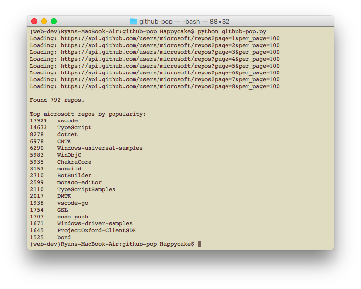

# GitHub-pop

A simple command-line tool to find the most popular repositories for a particular GitHub user or organization.

Here, `popularity = #stars + #forks`, and we display any repo which contains at least 1% of the user/org's overall popularity.

An example use case might be to find the most popular repositories for a large organization, such as **Microsoft** (and thus filtering out the dozens of tiny repos we don't want to see).  This could be taken as a measure of a repo's importance to both the organization and the community at large.

